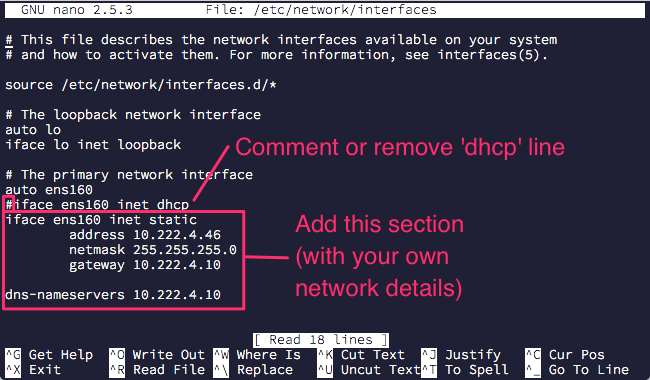
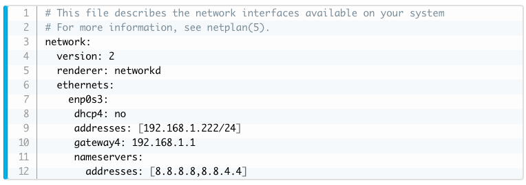

# Kubernetes (k3s) Setup
> Step by step instructions on how to get up and running with k3s on a local or private Ubuntu VM

## Table of Contents

- [Minimum Requirements](#minimum-requirements)
- [Once Off Setups](#once-off-setups)
    - [Update Ubuntu Server](#update-ubuntu-server)
    - [Install OpenSSH Server](#install-openssh-server)
    - [Install CURL](#install-curl)
    - [Setup Static IP Address on Ubuntu](#setup-static-ip-address-on-ubuntu)
        - [Ubuntu 16](#ubuntu-16)
        - [Ubuntu 18](#ubuntu-18)
    - [Install k3s](#install-k3s)
    - [Enable kubectl access on 3rd party OS](#enable-kubectl-access-on-3rd-party-os) *(COMING SOON)*
    - [Setup Helm and Tiller](#setup-helm-and-tiller) *(COMING SOON)*
    - [Setup Local Path Provisioner for PVC](#setup-local-path-provisioner-for-pvc) *(COMING SOON)*
    - [Setup MetalLB Load Balancer](#setup-metallb-load-balancer) *(COMING SOON)*
    - [Setup Kubernetes Dashboard](#setup-kubernetes-dashboard) *(COMING SOON)*
- [Related Links](#related-links)

## Minimum Requirements

- [Ubuntu Server 16 or 18](https://www.ubuntu.com/#download)
    - For a small k3s implementation (i.e. dev environment)
        - 1 CPU
        - 4GB Memory
        - 10GB HDD
- [Kubernetes CLI - kubectl](https://kubernetes.io/docs/tasks/tools/install-kubectl/)

> ***NOTE:*** Unless told otherwise, all instructions happen via a Terminal or Command Prompt

## Once Off Setups

This section focuses on once-off setups to get the k3s environment up and running

### Update Ubuntu Server

- `sudo apt-get update`
- `sudo apt-get upgrade`

### Install OpenSSH Server

- `sudo apt-get install openssh-server`

### Install CURL

- `sudo apt install curl`

### Setup Static IP Address on Ubuntu

#### Ubuntu 16

- Sourced from Michael Mckinnon's blog
    - [Configure static IP address on Ubuntu 16.04 LTS Server](https://michael.mckinnon.id.au/2016/05/05/configuring-ubuntu-16-04-static-ip-address/)
- Edit network interface
    - `sudo nano /etc/network/interface`
- Comment or remove the 'dhcp' line (See image below)
- Add static section with your own network details (See image below)
- Restart the network service
    - `sudo /etc/init.d/networking restart`
- If you receive errors during this time or if you're using SSH, perform a reboot instead
    - `sudo reboot`

#### Ubuntu 18

- Sourced from LinuxConfig's blog
    - [How to configure static IP address on Ubuntu 18.04 Bionic Beaver Linux](https://linuxconfig.org/how-to-configure-static-ip-address-on-ubuntu-18-04-bionic-beaver-linux)
- Navigate to netplan directory
    - `cd /etc/netplan`
- Edit network interface
    - `sudo nano 50-cloud-init.yaml`
- Restructure network interface based on the below image
    - *NB: Take note of the ethernet port name in the file before overriding it*
    - *NOTE: Apply your own IP Addresses, gateways, dns, etc.*

- Restart the network service
    - `sudo netplan apply`
- If you receive errors during this time or if you're using SSH, perform a reboot instead
    - `sudo reboot`

### Install k3s

- `curl -sfL https://get.k3s.io | sh -`

### Enable kubectl access on 3rd party OS

> COMING SOON

### Setup Helm and Tiller

> COMING SOON

### Setup Local Path Provisioner for PVC

> COMING SOON

### Setup MetalLB Load Balancer

> COMING SOON

### Setup Kubernetes Dashboard

> COMING SOON

## Related Links
* [k3s](https://azure.microsoft.com/en-us)
* [Kubernetes](https://kubernetes.io)
* [Ubuntu](https://www.ubuntu.com)
* [Local Path Provisioner by Rancher](https://github.com/rancher/local-path-provisioner)
* [MetalLB Load Balaner](https://metallb.universe.tf)
* [VS Code](https://code.visualstudio.com)
* [VS Code Kubernetes Extension](https://marketplace.visualstudio.com/items?itemName=ms-kubernetes-tools.vscode-kubernetes-tools)